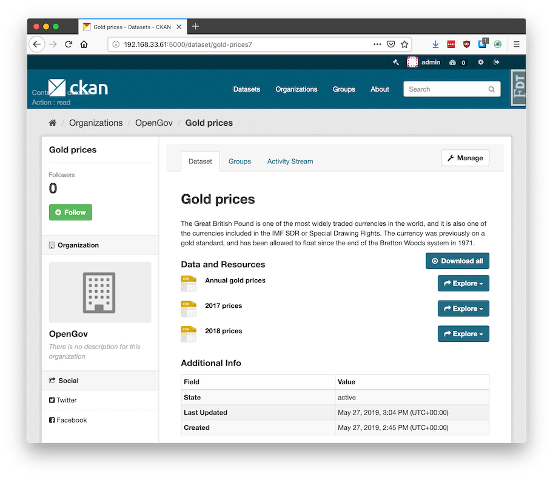

[](https://github.com/SDM-TIB/ckanext-downloadall/actions/workflows/test.yml)
[](https://pypi.python.org/project/ckanext-downloadall/)
[](https://pypi.python.org/project/ckanext-downloadall/)
[](https://pypi.python.org/project/ckanext-downloadall/)
[](https://pypi.python.org/project/ckanext-downloadall/)

# ckanext-downloadall

This CKAN extension adds a "Download all" button to datasets. This downloads a zip file containing all the resource files and a `datapackage.json`.



This zip file is a good way to package data for storing or sending, because:

- You keep all the data files together
- You include the documentation (metadata) – avoids the common problem of being handed some data files and not knowing anything about them or where to find info
- The metadata is machine-readable, so can be used by tools, software, and in automated workflows. For example:
  - Validating a series of data releases all meet a standard schema
  - Loading it into a database, using the column types and foreign key relations specified in the metadata

The `datapackage.json` is a [Frictionless Data](https://frictionlessdata.io/specs/data-package/) standard, also known as a Data Package.

## Technical Notes

If the resource is pushed/xloaded to DataStore, the schema (column types) is also included in the `datapackage.json` file.

Each resource entry in `datapackage.json` carries a `ckan_url_type` field that indicates whether the resource is bundled inside the ZIP or is an external link:

| `ckan_url_type` | Meaning |
|-----------------|---|
| `"upload"`      | File is bundled inside the ZIP; `path` points to the local filename within the archive. |
| `"external"`    | Resource is an external link; `path` is the original remote URL. |

This makes it straightforward to distinguish uploaded files from linked resources when importing the datapackage into another system, without having to inspect whether `path` looks like a URL or a filename.

This extension uses a hybrid approach for zip generation:

- **Small datasets** (total resource size below the configured threshold) use a background job to pre-generate the zip every time the dataset is created or updated (or its data dictionary is changed). The resulting zip is stored in the CKAN filestore and served directly on demand. This suits CKANs where all files are uploaded – if the underlying data file changes without the CKAN URL changing, then the zip will not include the update (until something else triggers the zip to update).

- **Large datasets** (total resource size at or above the configured threshold) are never pre-generated. Instead, the zip is assembled on the fly and streamed directly to the browser when the user clicks "Download all", without consuming any additional disk space. The threshold is configurable – see `ckanext.downloadall.stream_threshold_bytes` in the Config Settings section.

(This extension is inspired by [ckanext-packagezip](https://github.com/datagovuk/ckanext-packagezip), but that is old and relied on ckanext-archiver and IPipe.)

---

## Requirements

| CKAN version | Compatibility |
|--------------|---------------|
| 2.8 and earlier | No |
| 2.9 | Yes |
| 2.10 | Yes – not tested though |
| 2.11 and later | Unknown |

Designed to work with CKAN 2.9+

Ideally it is used in conjunction with DataStore and [xloader](https://github.com/ckan/ckanext-xloader) (or datapusher), so that the Data Dictionary is included as a schema in the `datapackage.json`, to describe the column types.

---

## Installation

To install `ckanext-downloadall`:

1. Activate your CKAN virtual environment, for example:

   ```bash
   . /usr/lib/ckan/default/bin/activate
   ```

2. Install the `ckanext-downloadall` Python package into your virtual environment:

   ```bash
   pip install ckanext-downloadall
   ```

3. Add `downloadall` to the `ckan.plugins` setting in your CKAN config file (by default the config file is located at `/etc/ckan/default/production.ini`). For example:

   ```ini
   ckan.plugins = downloadall
   ```

4. Restart the CKAN worker. For example, if you've deployed it with supervisord:

   ```bash
   sudo supervisorctl restart ckan-worker:ckan-worker-00
   ```

5. Restart the CKAN server. For example, if you've deployed CKAN with Apache on Ubuntu:

   ```bash
   sudo service apache2 reload
   ```

6. Ensure the background job 'worker' process is running – see [Running Background Jobs](https://docs.ckan.org/en/2.8/maintaining/background-tasks.html#running-background-jobs)

---

## Config Settings

```ini
# Total resource size in bytes at or above which a dataset's "Download all"
# zip is streamed on demand instead of being pre-generated and stored in the
# filestore. Set to 0 to stream all datasets. Set to a very large value to
# effectively disable streaming and pre-generate everything.
# (optional, default: 104857600 = 100 MB).
ckanext.downloadall.stream_threshold_bytes = 104857600

# Include additional fields from the dataset in the datapackage.json (e.g.
# those defined in a ckanext-scheming schema)
# (optional, space-separated list).
ckanext.downloadall.dataset_fields_to_add_to_datapackage = district county

# Maximum size (in bytes) for individual resources to include in the zip.
# Resources larger than this will be excluded from the zip and marked as
# external resources in the datapackage.json
# (optional, no limit by default).
# Examples: 104857600 (100MB), 1073741824 (1GB)
ckanext.downloadall.max_resource_size = 104857600

# Include external resources (links) in the zip download package.
# When set to false (default), only directly-uploaded files are included.
# When set to true, external resources are also downloaded and included.
# (optional, default: true)
ckanext.downloadall.include_external_resources = false

# Timeout in seconds for background zip generation jobs.
# Increase this for very large datasets that take longer to process.
# (optional, default: 1800)
ckanext.downloadall.job_timeout = 1800
```

---

## Command-line Interface

There is a command-line interface, assuming your `ckan.ini` is located at `/etc/ckan/default`:

```bash
ckan -c /etc/ckan/default/ckan.ini downloadall --help
```

Examples of use:

```bash
ckan -c /etc/ckan/default/ckan.ini downloadall update-zip gold-prices
ckan -c /etc/ckan/default/ckan.ini downloadall update-all-zips
```

---

## Troubleshooting

**"All resource data" appears as a normal resource, instead of seeing a "Download All" button**

You need to enable this extension in the CKAN config and restart the server. See the Installation section above.

**ImportError: No module named datapackage**

This means you have an older version of `ckanapi`, which is a dependency of `ckanext-downloadall`. Install a newer version.

**OSError: [Errno 13] Permission denied: '/data/ckan/resources/c89'**

You are trying to update zips from the command-line but running the tasks synchronously, rather than with the normal worker process. In this case, you need to run it as the `www-data` user, for example:

```bash
sudo -u www-data /usr/lib/ckan/default/bin/downloadall -c /etc/ckan/default/production.ini update-all-zips --synchronous
```

---

## Development Installation

To install `ckanext-downloadall` for development, activate your CKAN virtualenv and do:

```bash
git clone https://github.com/SDM-TIB/ckanext-downloadall.git
cd ckanext-downloadall
pip install -e .
pip install -r dev-requirements.txt
```

Remember to run the worker (in a separate terminal):

```bash
ckan -c /etc/ckan/default/development.ini jobs worker
```

---

## Running the Tests

To run the tests, do:

```bash
pytest --ckan-ini=test.ini
```

To run the tests and produce a coverage report, first make sure you have `pytest-cov` installed in your virtualenv (`pip install pytest-cov`), then run:

```bash
pytest --ckan-ini=test.ini --cov=ckanext.downloadall --cov-report=term-missing
```

---

## Releasing a New Version of ckanext-downloadall

`ckanext-downloadall` is available on PyPI at https://pypi.org/project/ckanext-downloadall/. To publish a new version to PyPI, follow these steps:

1. Update the version number in the `setup.py` file. See [PEP 440](http://legacy.python.org/dev/peps/pep-0440/#public-version-identifiers) for version numbering guidance.

2. Update the `CHANGELOG.md` with details of this release.

3. Make sure you have the latest version of necessary packages:

   ```bash
   pip install --upgrade setuptools wheel twine
   ```

4. Create a source and binary distribution of the new version:

   ```bash
   python setup.py sdist bdist_wheel && twine check dist/*
   ```

   Fix any errors you get.

5. Upload the source distribution to PyPI:

   ```bash
   twine upload dist/*
   ```

6. Commit any outstanding changes:

   ```bash
   git commit -a
   git push
   ```

7. Tag the new release of the project on GitHub with the version number from the `setup.py` file. For example, if the version number in `setup.py` is `0.1.0`, then do:

   ```bash
   git tag 0.1.0
   git push --tags
   ```

## License
`ckanext-downloadall` is licensed under APGL-3.0, see the [license file](LICENSE).
